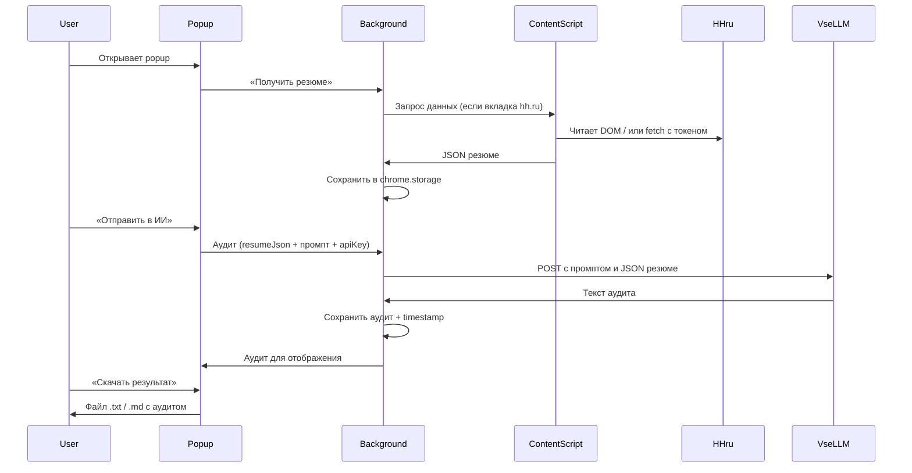

# План и архитектура: расширение «Аудит резюме»

## Цель

Chrome-расширение, которое:
1. Получает резюме с HH.ru (токен/API или парсинг страницы).
2. Собирает данные в единый JSON.
3. Отправляет JSON в DeepSeek через VseLLM API по настроенному промпту.
4. Показывает аудит и рекомендации и даёт сохранить результат локально.

---

## Архитектура (компоненты)

```
┌─────────────────────────────────────────────────────────────────┐
│                    Chrome Extension (Manifest V3)                │
├─────────────────────────────────────────────────────────────────┤
│  Popup (popup.html + popup.js)                                   │
│  • Кнопки: «Получить резюме», «Отправить в ИИ»                   │
│  • Блок «Последний аудит» + «Скачать результат»                  │
├─────────────────────────────────────────────────────────────────┤
│  Options (options.html + options.js)                              │
│  • Токен HH.ru, API-ключ VseLLM, промпт аудита                   │
├─────────────────────────────────────────────────────────────────┤
│  Background (background.js — service worker)                    │
│  • Оркестрация: запрос резюме → вызов API → сохранение           │
│  • apiClient.js: вызов VseLLM/DeepSeek                            │
├─────────────────────────────────────────────────────────────────┤
│  Content Script (contentScript.js) — только на hh.ru             │
│  • Парсинг DOM страницы резюме → JSON                            │
│  • Отправка в background через chrome.runtime.sendMessage        │
└─────────────────────────────────────────────────────────────────┘
         │                                    │
         ▼                                    ▼
   HH.ru (страница/API)              VseLLM / DeepSeek API
```

---

## Логика выполнения (поток данных)



**Кратко по шагам:**

1. **Пользователь на hh.ru** открывает страницу своего резюме (или список резюме).
2. **В popup** нажимает «Получить резюме с HH.ru» → background просит content script на активной вкладке собрать данные → приходит JSON → сохраняется в `chrome.storage`.
3. **В popup** нажимает «Отправить в ИИ» → background подставляет JSON в промпт, дергает VseLLM (DeepSeek), получает текст аудита → сохраняет и отдаёт в popup.
4. **Результат** можно просмотреть в popup и скачать кнопкой «Скачать результат».

---

## Задачи по плану (чеклист)

| № | Задача | Статус |
|---|--------|--------|
| 1 | Создать структуру расширения (manifest, background, content script, popup, options) | pending |
| 2 | Реализовать получение резюме с HH.ru (DOM или API) и нормализация в JSON | pending |
| 3 | Подключить VseLLM/DeepSeek API, функция аудита и обработка ошибок | pending |
| 4 | Сохранение резюме, аудита и настроек в chrome.storage + экспорт в файл | pending |
| 5 | UI popup и страницы настроек (статусы, ошибки) | pending |
| 6 | README и краткое описание архитектуры | pending |

---

## Структура файлов проекта

```
RASHOTKLIK/
├── manifest.json
├── ASSEMBLY_PLAN.md          ← пошаговая сборка для ИИ (новый чат)
├── PLAN_AND_ARCHITECTURE.md  ← этот файл
├── README.md
├── prompts/                  ← промпты для аудита (пока локально в расширении)
│   ├── default-audit.txt     ← промпт по умолчанию (плейсхолдер RESUME_JSON)
│   └── README.md              ← описание; в дальнейшем источник — удалённый URL
├── popup/
│   ├── popup.html
│   ├── popup.js
│   └── popup.css
├── options/
│   ├── options.html
│   ├── options.js
│   └── options.css
└── scripts/
    ├── background.js
    ├── contentScript.js
    └── apiClient.js
```

---

## Хранение промптов

- **Сейчас:** папка **`prompts/`** в корне проекта (рядом с расширением). Файл `prompts/default-audit.txt` — промпт по умолчанию для аудита; в настройках расширения можно загрузить его в поле «Промпт аудита» и при необходимости отредактировать. Сохранённое значение хранится в `chrome.storage.local`.
- **Позже:** планируется загрузка промпта из **удалённого источника** (URL вне расширения). Логику выбора «локальный файл / удалённый URL» заложить при реализации модуля Options и apiClient.

---

## Как собирать проект (для ИИ / новый чат)

Открой файл **[ASSEMBLY_PLAN.md](ASSEMBLY_PLAN.md)** и выполни сборку модуль за модулем по инструкциям. В новом чате можно сказать: «Открой ASSEMBLY_PLAN.md и собери расширение по плану пошагово».

---

## Ссылки

- VseLLM (API-ключ, дашборд): https://vsellm.ru/account/dashboard
- HH.ru: страница резюме или API (если доступно)
